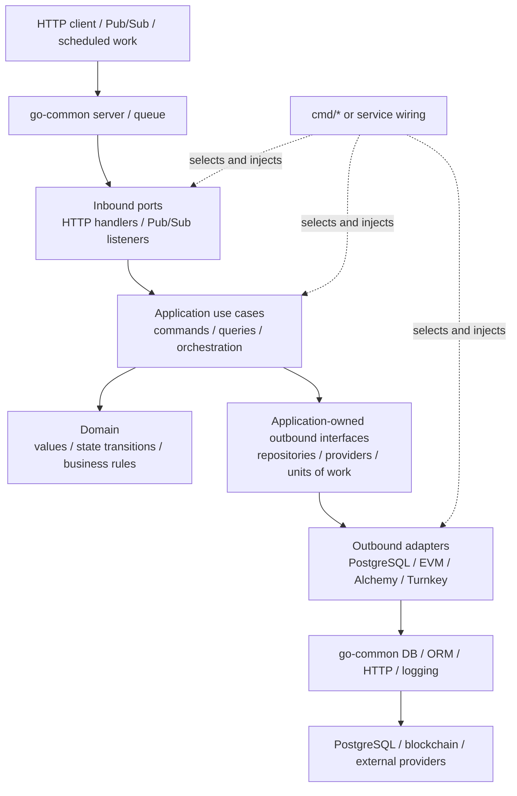

# go-common

Shared, multi-module Go libraries and the development builder image used by
Global Torque services.

## Architectural Role

`go-common` is a shared technical platform, not a business application and not
the domain layer of another service. It provides reusable mechanisms for
configuration, logging, HTTP serving, validation, PostgreSQL, Pub/Sub, error
serialization, and test infrastructure. Business policy such as wallet,
investment, offer, or Vault rules belongs in the consuming service.

The modules form this conceptual stack:

| Group | Modules | Responsibility |
|---|---|---|
| Foundations | `configurator`, `context`, `response`, `verser`, `misc` | Configuration, request metadata, shared error shapes, build metadata, and small generic utilities |
| Technical infrastructure | `logger`, `db`, `orm`, `httputils`, `validator` | Logging, PostgreSQL connectivity and queries, HTTP helpers, and DTO validation |
| Runtime transports | `server`, `queue` | Echo/Fx HTTP runtime and Google Pub/Sub pull/push infrastructure |
| Test infrastructure | `tests`, `db/dbtests`, `queue/qtests` | Table scenarios, database fixtures, and HTTP/Pub/Sub test actions |
| Build support | `docker` | Shared development builder image and dependency cache; not an application library |

This grouping describes responsibilities, not a requirement that every module
depend on the group below it. Each module should keep the smallest useful
dependency graph and remain independently releasable.

## How Consuming Applications Should Be Layered

Applications such as `evm-api` use `go-common` at their technical boundaries.
A clean request or event flow looks like this:



At runtime, an application calls an injected repository or provider interface.
At compile time, the concrete adapter imports and implements the
application-owned contract. This keeps infrastructure replaceable without
making business code depend on PostgreSQL, Echo, Pub/Sub, or provider SDKs.

The expected package responsibilities are:

| Application location | Responsibility |
|---|---|
| `cmd/*`, `internal/service`, or bootstrap packages | Select concrete implementations and wire the process |
| `internal/ports/http`, `internal/ports/pubsub` | Decode and validate transport input, call one use case, and map results back to the transport |
| `internal/app/<feature>` | Orchestrate a business operation and own the narrow interfaces it consumes |
| `internal/domain` | Own transport-neutral business vocabulary, invariants, and state transitions |
| `internal/adapters` | Implement persistence, provider, blockchain, queue, and other external-system contracts |
| `go-common` | Supply generic technical mechanisms shared by multiple services |

Keep dependencies pointing inward:

```text
cmd/service wiring -> ports and concrete adapters
ports -> application -> domain
adapters -> application/domain contracts
domain -> standard library where practical
```

### HTTP Flow

1. `go-common/server` owns Echo startup, common middleware, validation,
   health/metrics endpoints, route registration, and graceful shutdown.
2. A service HTTP port binds path, query, and body data and validates its
   transport DTO.
3. The port invokes an application command or query through a narrow
   interface.
4. The application enforces business rules and calls repository or provider
   interfaces.
5. Adapters perform SQL, RPC, or provider SDK work.
6. The HTTP port maps application/domain errors to the public response.

### Domain-Event Flow

1. `go-common/queue/v2/domainevents` defines the versioned transactional-outbox
   contract.
2. `go-common/queue/v2/pubsubpush` strictly validates the Pub/Sub envelope,
   exact subscription, transport metadata, event payload, and delivery
   metadata.
3. The service port maps the validated event to an immutable application
   command.
4. The service owns reaction claims, deduplication, current-state
   reconciliation, and idempotent business effects.
5. Valid irrelevant events are acknowledged; malformed permanent failures and
   retryable application failures are returned according to the transport's
   retry/DLQ policy.

`go-common` deliberately does not decide which business command an event
causes or persist service-specific deduplication state. The queue module exposes
interfaces so the consuming service retains that policy and storage ownership.

## Boundary Rules

- Put shared mechanisms here only after their ownership and cross-service
  contract are clear. Do not move service-specific business logic into
  `go-common` merely to reuse code.
- Define repository and provider interfaces where the application consumes
  them. Prefer small capability interfaces over one service-wide provider or
  repository interface.
- Keep Echo contexts, HTTP DTOs, Pub/Sub envelopes, pgx rows, generated database
  models, and provider SDK types outside application/domain contracts. Map them
  at ports or adapters.
- Keep expected client-visible errors structured, but defer HTTP status mapping
  to the HTTP boundary when the use case is also called by workers or jobs.
- Use `context.Context` for cancellation, deadlines, tracing, and observability.
  Pass actor, tenant, and authorization facts explicitly when they are part of
  a business rule.
- Put transaction start, commit, rollback, locking, and database error mapping
  in adapters. Keep the business mutation and side-effect ordering decision in
  the application use case.
- Normal unit and integration tests must use deterministic fakes, mocks,
  emulators, and fixtures; they must not require live provider credentials.

## Application Migration Guidance

`evm-api` currently contains two architectural styles. Newer feature packages
such as `offerwallet`, `contractdeployment`, `vaultlifecycle`, and
`domainreaction` use command-oriented application code with narrow repository,
provider, and unit-of-work interfaces. Older `general`, `apiauth`,
`apiinternal`, and parts of `worker` still combine orchestration with direct
database, generated-model, ABI, and provider dependencies.

Extend the feature-local command/interface style for new behavior. Migrate old
flows incrementally when they change; avoid a directory-only rewrite that does
not first separate responsibilities. Concrete use-case adapter construction
should ultimately live in `cmd/*` or a dedicated service/bootstrap package,
even when legacy wiring currently occurs inside an application factory.

### Module-Path Migration Warning

The legacy `github.com/webdevelop-pro/go-common/*` modules and the current
`github.com/global-torque/go-common/*/v2` modules are different Go packages,
even where their source APIs look similar. Named error and concrete types,
context keys, and package-level state do not cross those paths automatically.
Structural interfaces may happen to match, but that does not make the packages
interchangeable.

Do not introduce both generations into a new flow. When migrating an existing
service, move a coherent boundary together—for example its context keys,
logger, response errors, server, validator, DB interfaces, and tests—and verify
that `go.mod` no longer retains an unintended duplicate dependency graph.

## Go Modules

There is no root Go module. Each top-level component has its own `go.mod` and
is published independently with a component-prefixed semantic version tag:

```text
github.com/global-torque/go-common/db/v2     -> db/v2.0.2
github.com/global-torque/go-common/orm/v2    -> orm/v2.0.2
github.com/global-torque/go-common/queue/v2  -> queue/v2.0.11
```

Use `go.work` for local cross-module development. Run repository validation
from the root:

```sh
./make.sh vet
./make.sh lint
./make.sh test
```

For a release, validate the exact component commit, create an annotated
`<component>/vX.Y.Z` tag, push that ref, and verify that the version resolves
with `GOWORK=off go mod download -json`.

## Development Builder Image

The image is published as:

```text
cr.webdevelop.pro/global-torque/go-common:latest-dev
```

It contains Go 1.25.8, native build packages, shared lint/security tools,
go-common dependencies, and pre-warmed module/build caches for `evm-api`.
The cache is stored at `/go/pkg/mod` and `/go/build-cache`, matching both the
`evm-api` builder and its Compose named-volume mount points.

Build and publish the default amd64/arm64 image:

```sh
./docker/build-deploy.sh
```

To publish only one platform (useful for a dev-only refresh):

```sh
PLATFORMS=linux/amd64 ./docker/build-deploy.sh
```

The script publishes both the short commit tag and `latest-dev`. The root CI
also builds the multi-platform image after vet and tests pass on `master`.

When `evm-api/go.mod` or its direct external imports change, refresh
`docker/evm-api-cache/evm-api.mod`, `docker/evm-api-cache/evm-api.sum`, and
`docker/evm-api-cache/dependencies.go` before publishing a new image.

## Using The Image

```Dockerfile
FROM cr.webdevelop.pro/global-torque/go-common:latest-dev AS builder

WORKDIR /app
COPY go.mod go.sum ./
RUN go mod download
COPY . .
RUN ./make.sh build
```

See [docker/readme.md](docker/readme.md) for image details and `AGENTS.md` for
the package map and release safeguards.
